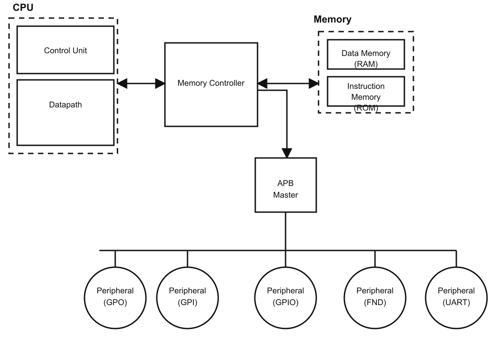
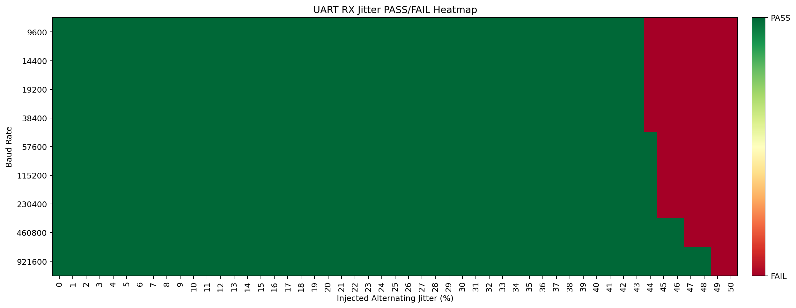
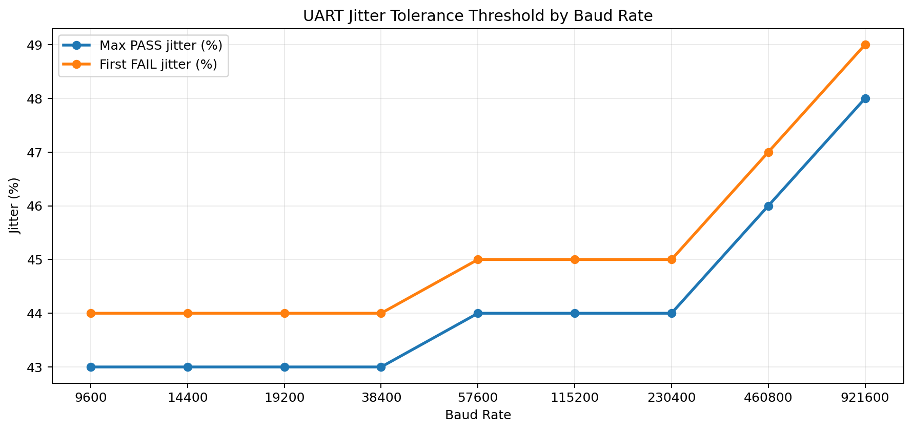
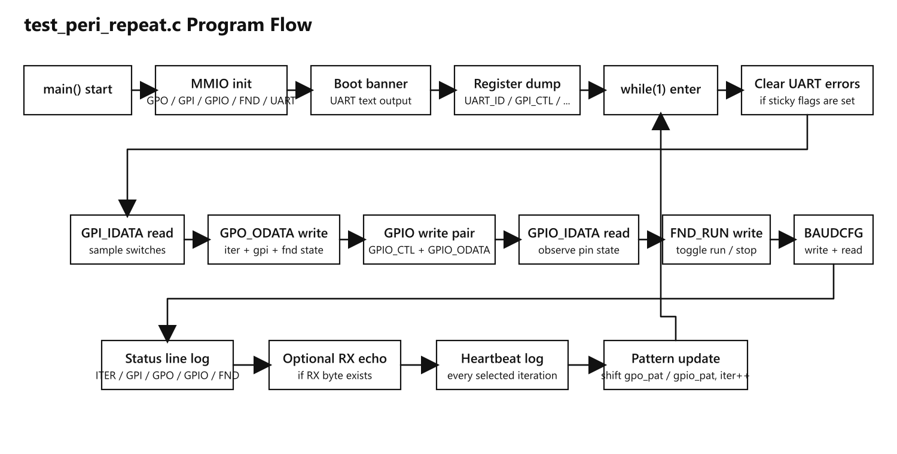
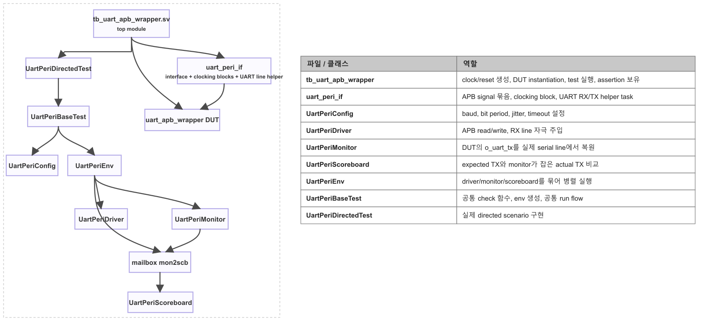

# RISC-V Multicycle Peripheral Project

RV32I multicycle CPU에 APB 기반 주변장치를 연결한 프로젝트입니다.  
문서 구성은 CPU 전체 구조보다 MMIO 연동, UART peripheral 분석, full-top 로그 검증 쪽에 비중을 두고 정리했습니다.

## 개요

- 구조: RV32I multicycle CPU + memory controller + APB bridge + peripheral
- 주변장치: `GPI`, `GPO`, `GPIO`, `FND`, `UART`
- 확인한 축:
  - MMIO register map
  - UART APB wrapper / core / TX / RX 구조
  - UART class 기반 directed verification
  - `test_peri_repeat.c` 기반 full-top 반복 실행 로그
  - implementation timing / utilization

## 시스템 그림



## 먼저 볼 문서

- [START_HERE_ko.md](START_HERE_ko.md)
- [개요 보고서](md/reports/riscv_multicycle_peri_overview_ko.md)
- [UART 주변장치 보고서](md/reports/uart_peripheral_report_ko.md)
- [UART jitter sweep 보고서](md/reports/uart_jitter_sweep_report_ko.md)
- [Peripheral 반복 실행 보고서](md/reports/test_peri_repeat_execution_report_ko.md)
- [Register configuration](md/reports/register_config.md)
- [발표자료.pdf](발표자료.pdf)

## 대표 결과

| 항목 | 내용 |
| --- | --- |
| UART directed verification | `6 / 6 PASS`, TB assertion `3개`, failed assertion `0개` |
| RX jitter sweep | baud별 최대 PASS 구간 `43% ~ 48%` |
| Full-top ROM 실행 | boot banner, MMIO 접근, `ITER 0x00` 로그 확인 |
| Timing | `100 MHz` 제약 만족, routed `WNS = 0.843 ns` |
| Utilization | Slice LUT `3186`, Register `627`, Block RAM Tile `2` |

## 결과 그림

UART jitter sweep 결과:





full-top peripheral 반복 실행 흐름:



UART class 기반 검증 구조:



## 폴더 구조

```text
RISC-V_multicycle/
├─ src/
│  ├─ cpu/                     # multicycle CPU, memory, controller
│  ├─ apb/                     # APB bridge / bus logic
│  ├─ GPIO_peri/               # GPI/GPO/GPIO wrapper
│  ├─ fnd_feri/                # seven-segment peripheral
│  └─ uart_peri/               # UART wrapper, core, FIFO, source blocks
├─ tb/
│  ├─ Top_module_tb.sv
│  ├─ tb_Top_module_peri_repeat_log.sv
│  └─ uart_peri_tb/            # class 기반 UART verification
├─ md/
│  ├─ reports/                 # 보고서
│  ├─ visuals/                 # 그림, 차트, 다이어그램
│  ├─ data/                    # CSV, HTML data view
│  ├─ build_reports/           # timing / utilization / power report
│  └─ reference/               # mmio.h 등 참조 자료
├─ cpu_test/
│  └─ test_peri_repeat.c
├─ output/
│  ├─ peri_repeat_release/     # ELF, release program.mem
│  └─ tmp_verify/              # transcript 보관본
├─ program.mem
├─ 발표자료.pdf
└─ README.md
```

## 주요 경로

- RTL: `src/`
- Testbench: `tb/`
- 문서: `md/reports/`
- 시각 자료: `md/visuals/`
- C firmware: `cpu_test/test_peri_repeat.c`
- 실행 산출물: `output/peri_repeat_release/`

## 메모

- 이 폴더는 CPU 전체 기능을 넓게 설명하기보다 peripheral/MMIO 동작을 직접 확인할 수 있는 자료 위주로 정리했습니다.
- `test_peri_repeat.c`와 `sim_transcript.txt`를 함께 보면 ROM 코드, MMIO 접근, UART 로그를 같은 흐름으로 따라갈 수 있습니다.
