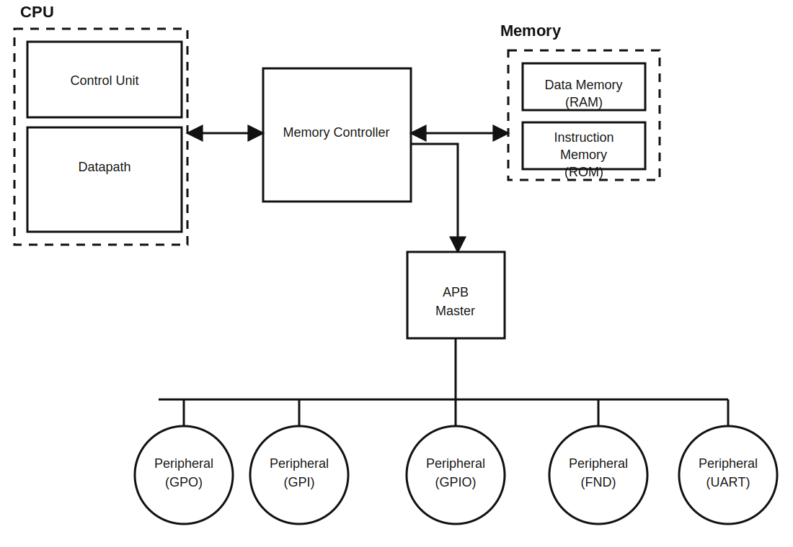

# RISC-V Multicycle Peripheral 개요

## 1. 프로젝트 범위

이 프로젝트는 RV32I multicycle CPU에 APB 기반 주변장치를 연결하고, MMIO 접근과 UART 동작을 중심으로 정리한 자료입니다.  
문서의 중심은 CPU 파이프라인 세부 분석보다 peripheral 연동, UART 검증, full-top 로그 확인에 있습니다.

## 2. 시스템 구성

상위 구조는 아래와 같이 볼 수 있습니다.

- `Top_CPU`: multicycle CPU
- `Top_Memory_CNTL`: memory / APB 요청 분기
- `Top_Memory`: ROM / RAM
- `Top_APB`: APB peripheral 연결
- peripheral:
  - `GPI`
  - `GPO`
  - `GPIO`
  - `FND`
  - `UART`

## 3. MMIO 구성

| Peripheral | Base Address | 역할 |
| --- | ---: | --- |
| `GPO` | `0x2000_0000` | 출력 enable / data 제어 |
| `GPI` | `0x2000_1000` | 외부 입력 읽기 |
| `GPIO` | `0x2000_2000` | bidirectional GPIO |
| `FND` | `0x2000_3000` | seven-segment run 제어 |
| `UART` | `0x2000_4000` | TX/RX, status, control, baud config |

상세 register 설명은 [register_config.md](./register_config.md)에서 볼 수 있습니다.

## 4. 정리한 자료의 축

### 4.1 UART peripheral 분석

- [uart_peripheral_report_ko.md](./uart_peripheral_report_ko.md)
- [uart_accumulator_baud_report_ko.md](./uart_accumulator_baud_report_ko.md)
- [uart_verification_visual_report.md](./uart_verification_visual_report.md)

정리한 내용:

- APB wrapper와 UART core 연결 구조
- TX/RX FIFO와 serializer / receiver 동작
- `phase accumulator` 기반 16x oversampling baud generator
- baud 오차와 tick quantization 해석

### 4.2 UART directed verification

- [uart_peri_tb_class_verification_report_ko.md](../../tb/uart_peri_tb/uart_peri_tb_class_verification_report_ko.md)
- [uart_jitter_sweep_report_ko.md](./uart_jitter_sweep_report_ko.md)
- [uart_verification_run_log.md](./uart_verification_run_log.md)

검증 시나리오:

- Reset / ID
- TX Path
- RX Normal
- RX Jitter
- Frame Error
- RX Overflow

요약 결과:

| 항목 | 결과 |
| --- | --- |
| Directed scenario | `6 / 6 PASS` |
| TB assertion | `3개 활성`, `0 fail` |
| Final line | `tb_uart_apb_wrapper PASSED` |

### 4.3 Full-top peripheral 반복 실행

- [test_peri_repeat_execution_report_ko.md](./test_peri_repeat_execution_report_ko.md)
- [test_peri_repeat_flow_ko.md](./test_peri_repeat_flow_ko.md)
- [test_peri_repeat.c](../../cpu_test/test_peri_repeat.c)
- [sim_transcript.txt](../../output/tmp_verify/top_peri_repeat/sim_transcript.txt)

확인한 흐름:

- boot banner 출력
- `GPI -> GPO -> GPIO -> FND -> UART_BAUDCFG` 접근
- `ITER 0x00 ...` UART 로그 확인
- peripheral별 첫 접근 PC 정리

## 5. UART jitter 결과

| Baud | 최대 PASS jitter | 최초 FAIL jitter |
| --- | ---: | ---: |
| `9600` | `43%` | `44%` |
| `14400` | `43%` | `44%` |
| `19200` | `43%` | `44%` |
| `38400` | `43%` | `44%` |
| `57600` | `44%` | `45%` |
| `115200` | `44%` | `45%` |
| `230400` | `44%` | `45%` |
| `460800` | `46%` | `47%` |
| `921600` | `48%` | `49%` |

이번 sweep은 alternating deterministic jitter 조건에서 RX가 어느 정도까지 버티는지를 보는 자료입니다.

## 6. 구현 결과

build report 기준 요약:

| 항목 | 값 |
| --- | --- |
| Clock target | `10.000 ns` (`100 MHz`) |
| Routed WNS | `0.843 ns` |
| Slice LUTs | `3186` |
| Slice Registers | `627` |
| Block RAM Tile | `2` |
| Bonded IOB | `51` |

관련 원본:

- [Top_module_timing_summary_routed.rpt](../build_reports/Top_module_timing_summary_routed.rpt)
- [Top_module_utilization_routed.rpt](../build_reports/Top_module_utilization_routed.rpt)
- [Top_module_power_routed.rpt](../build_reports/Top_module_power_routed.rpt)

## 7. 같이 보면 좋은 경로

- 프로젝트 안내: [README.md](../../README.md)
- 시작 문서: [START_HERE_ko.md](../../START_HERE_ko.md)
- `md/` 폴더 안내: [../README.md](../README.md)
- 저장소 루트 안내: [../../../README.md](../../../README.md)
- 발표 자료: [발표자료.pdf](../../발표자료.pdf)
