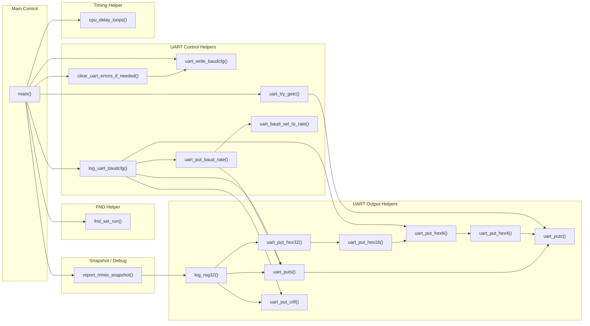

# `test.c` Program Flow and Code Structure

## 1. 문서 목적

이 문서는 CPU ROM에 사용한 C 코드 구조를 발표자료에서 설명하기 쉽도록 두 가지 관점으로 정리한 문서입니다.

- `Program Flowchart`: 실제 실행 순서 중심
- `Code Structure Diagram`: 함수 역할과 호출 관계 중심

대상 파일:

- [test_peri_repeat.c](../../cpu_test/test_peri_repeat.c)
- [mmio.h](../reference/mmio.h)

## 2. Program Flowchart

아래 그림은 `main()`의 실행 흐름을 중심으로, 초기화 이후 반복 루프에서 어떤 순서로 peripheral을 읽고 쓰는지 보여줍니다.

```mermaid
flowchart TD
    A["main() start"] --> B["Local state init<br/>blink, run_state,<br/>last_switches, last_baudcfg"]
    B --> C["MMIO register init<br/>GPO/GPI/GPIO/UART/FND"]
    C --> D["UART boot banner 출력"]
    D --> E["report_mmio_snapshot()<br/>초기 register dump 출력"]
    E --> F["while(1) loop"]

    F --> G["GPI_IDATA 읽기<br/>switches, baud source,<br/>run request, gpio pattern 계산"]
    G --> H["clear_uart_errors_if_needed()"]
    H --> I{"switch / baud 요청 변화?"}
    I -->|Yes| J["CFG request UART log 출력"]
    J --> K["uart_write_baudcfg()<br/>UART_BAUDCFG 갱신"]
    K --> L["last_switches 갱신"]
    I -->|No| M["run_state 확인"]
    L --> M

    M --> N{"FND run 요청 변화?"}
    N -->|Yes| O["fnd_set_run()<br/>FND_RUN 갱신"]
    N -->|No| P["UART_BAUDCFG read"]
    O --> P

    P --> Q["active_baud_sel 추출"]
    Q --> R["GPO_ODATA write<br/>switch mirror + active baud + source + run state"]
    R --> S["GPIO_ODATA write<br/>gpio_pattern 반영"]
    S --> T{"baudcfg 변화?"}
    T -->|Yes| U["log_uart_baudcfg()<br/>active baud 정보 출력"]
    T -->|No| V["uart_try_getc()"]
    U --> W["last_baudcfg 갱신"]
    W --> V

    V --> X{"RX byte 존재?"}
    X -->|Yes| Y["RX log 출력 + echo 전송"]
    X -->|No| Z{"heartbeat 시점?"}
    Y --> Z
    Z -->|Yes| AA["HB log 출력<br/>switch, gpio, run, active_rate"]
    Z -->|No| AB["cpu_delay_loops()"]
    AA --> AB
    AB --> AC["blink++"]
    AC --> F
```

## 3. Code Structure Diagram

아래 그림은 `test.c` 내부 함수들을 역할별로 묶어서 보여줍니다.  
핵심은 `main()`이 여러 helper 함수를 조합해 MMIO 데모 루프를 구성한다는 점입니다.

## 4. 코드 역할 요약

### 4.1 `main()`의 역할

`main()`은 아래 네 가지를 반복 수행하는 중심 제어 루프입니다.

1. 입력 스위치 상태를 읽고 현재 요청 상태를 해석
2. UART/FND/GPO/GPIO 설정을 반영
3. UART 로그와 heartbeat 메시지를 출력
4. 필요 시 RX 데이터를 echo 하고 busy-wait delay 수행

### 4.2 Helper 함수 묶음

| 묶음 | 함수 | 역할 |
|---|---|---|
| delay | `cpu_delay_loops()` | timer 없이 busy-wait 수행 |
| UART 출력 | `uart_putc()`, `uart_puts()`, `uart_put_hex*()`, `uart_put_crlf()` | 문자/문자열/16진수 로그 출력 |
| UART 상태 제어 | `clear_uart_errors_if_needed()`, `uart_write_baudcfg()`, `uart_try_getc()` | error clear, baud 설정, RX pop |
| UART 로깅 | `log_reg32()`, `log_uart_baudcfg()`, `uart_put_baud_rate()` | register/baud 상태 출력 |
| FND 제어 | `fnd_set_run()` | seven-segment run bit 제어 |
| 초기 상태 출력 | `report_mmio_snapshot()` | 부팅 직후 MMIO 상태 dump |

## 5. 발표용 설명 문구 예시

### 5.1 흐름도 설명

- `test.c`는 부팅 직후 peripheral을 초기화하고,
- 현재 MMIO 상태를 UART로 한 번 출력한 뒤,
- 무한 루프에서 switch 입력을 읽고 baud/FND/GPIO/GPO 상태를 계속 갱신합니다.

### 5.2 구조도 설명

- `main()`은 직접 모든 문자열 포맷팅을 하지 않고,
- UART 출력 helper, baud 설정 helper, snapshot helper, delay helper를 조합해서
- "작은 유틸 함수 + 단순한 main loop" 구조로 작성되어 있습니다.

## 6. 한 줄 정리

- `Program Flowchart`는 "코드가 어떤 순서로 실행되는가"를 보여줍니다.
- `Code Structure Diagram`은 "코드가 어떤 기능 블록들로 구성되는가"를 보여줍니다.
