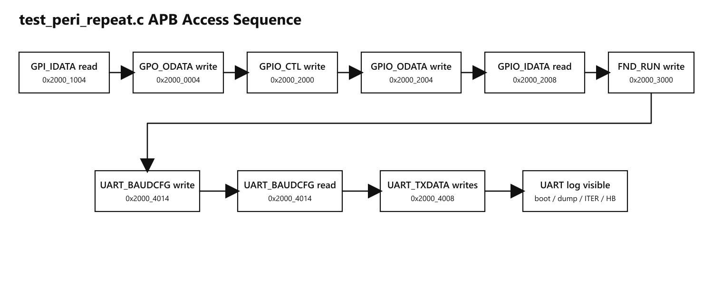

# `test_peri_repeat.c` 흐름 다이어그램

대상 코드:

- [test_peri_repeat.c](../../cpu_test/test_peri_repeat.c)

이 문서는 `test_peri_repeat.c`의 실행 흐름을 흰 배경/검은 선 기준으로 보기 쉽게 정리한 문서입니다.

## 1. Program Flow

## 2. APB Access Sequence

## 3. 요약

- 이 코드는 CPU ROM에서 각 peripheral register를 순차적으로 계속 접근하며, UART 로그와 APB waveform 둘 다에서 반복 패턴이 보이도록 설계된 루프형 테스트 코드입니다.
