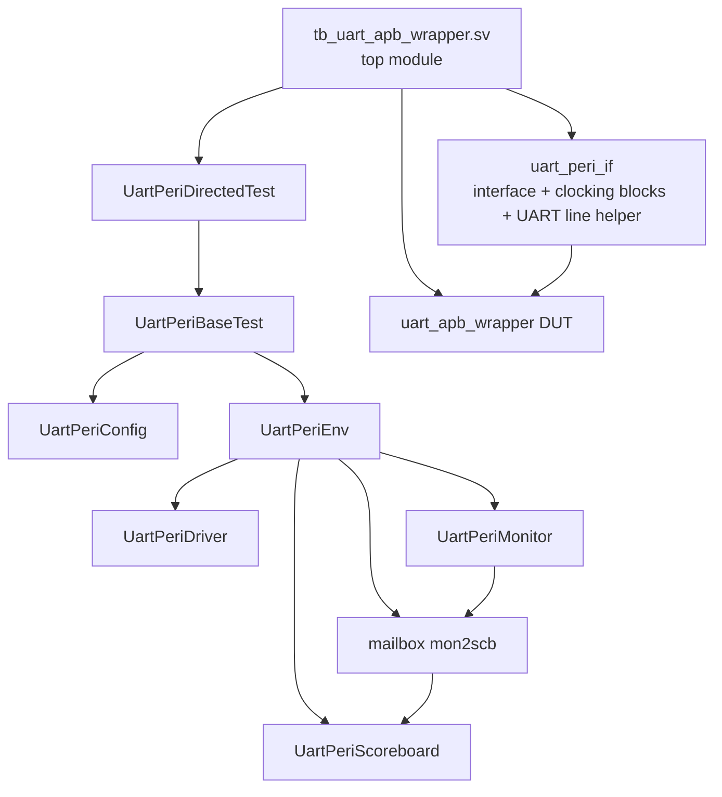
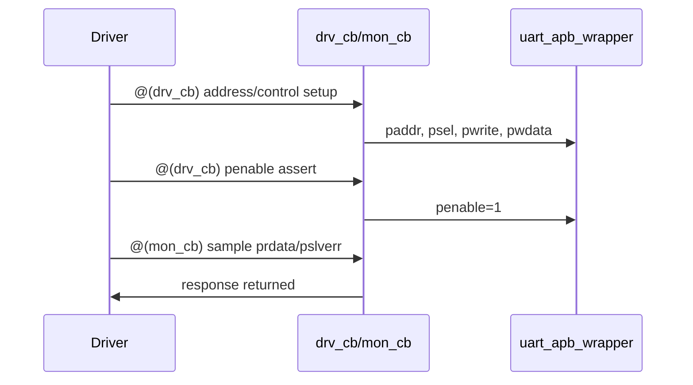
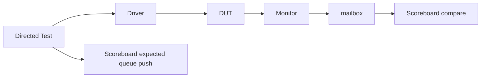
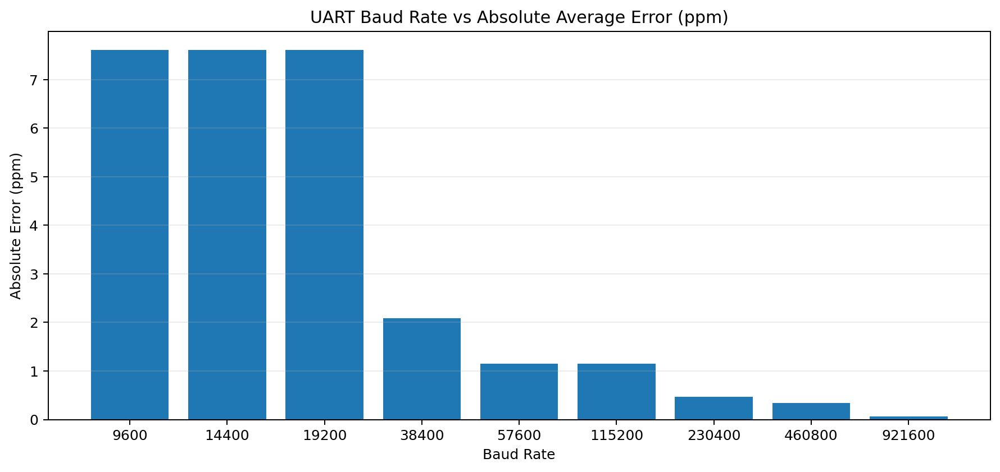
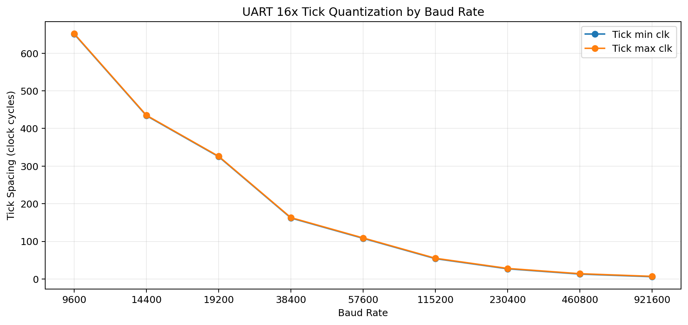
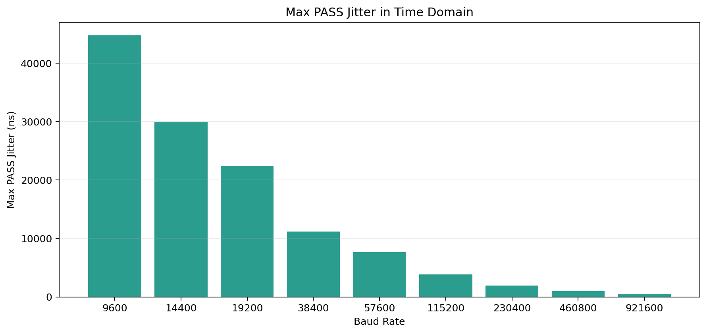

# UART Class 기반 검증 보고서

## 1. 목적

이 문서는 class 기반 UART peripheral testbench의 구조와 검증 시나리오를 발표용으로 설명하기 위해 작성한 자료입니다.

특히 아래 3가지를 중심으로 정리했습니다.

1. 시나리오를 자세히 설명하고 class 구조를 한눈에 보여주기
2. driver / monitor / scoreboard의 timing과 역할을 구체적으로 설명하기
3. 생성한 그래프가 각각 무엇을 의미하는지 발표용 문장으로 해석하기

## 2. TB 전체 구조

대상 폴더 구조:

```text
uart_peri_tb/
  interface.sv
  tb_pkg.sv
  tb_uart_apb_wrapper.sv
  include/
    tb_defs.svh
  objs/
    config.svh
    transaction.svh
  components/
    driver.svh
    monitor.svh
  env/
    environment.svh
    scoreboard.svh
  tests/
    base_test.svh
    test_uart_directed.svh
```

### 2.1 class / module 구조도



### 2.2 각 블록 역할

| 파일 / 클래스 | 역할 |
|---|---|
| `tb_uart_apb_wrapper.sv` | clock/reset 생성, DUT instantiation, test 실행, assertion 보유 |
| `uart_peri_if` | APB signal 묶음, clocking block, UART RX/TX helper task |
| `UartPeriConfig` | baud, bit period, jitter, timeout 설정 |
| `UartPeriDriver` | APB read/write, RX line 자극 주입 |
| `UartPeriMonitor` | DUT의 `o_uart_tx`를 실제 serial line에서 복원 |
| `UartPeriScoreboard` | expected TX와 monitor가 잡은 actual TX 비교 |
| `UartPeriEnv` | driver/monitor/scoreboard를 묶어 병렬 실행 |
| `UartPeriBaseTest` | 공통 check 함수, env 생성, 공통 run flow |
| `UartPeriDirectedTest` | 실제 directed scenario 구현 |

## 3. 시나리오 상세 설명

### 3.1 시나리오 목록

| 시나리오 | 자극 | 기대 결과 | 주요 검증 포인트 |
|---|---|---|---|
| Reset / ID | reset 후 `UART_ID`, `UART_STATUS`, `BAUDCFG` 읽기 | reset 상태 정상 | 기본 register map, default status |
| TX Path | APB로 `0x55`, `0xA3`, `0x0D` 전송 | `o_uart_tx`에서 같은 값 직렬 출력 | TX FIFO, serializer, stop bit |
| RX Normal | clean serial `0x3C` 주입 | `RXDATA=0x3C` | RX path, RX FIFO, APB read |
| RX Jitter | jittered `0xA6` 주입 | `RXDATA=0xA6` | RX sampling robustness |
| APB Baud Select | APB `BAUDCFG`로 baud source 전환 | APB-selected baud 수신 성공 | baud source mux, APB config path |
| Frame Error | bad stop bit frame 주입 | `FRAME_ERROR` set/clear | stop bit check, sticky clear |
| RX Overflow | 32byte burst + 1byte 추가 | overflow set, 마지막 byte drop | FIFO full policy, drain ordering |

### 3.2 시나리오 흐름


### 3.3 왜 각 시나리오가 필요한가

#### Reset / ID
- 주변장치가 reset 후 어떤 초기값을 가지는지 확인
- 잘못된 register decode나 초기화 누락을 가장 먼저 잡아냄

#### TX Path
- software가 APB write한 값이 실제 line으로 어떻게 나가는지 확인
- 단순 register write만 맞고 serial output이 틀리는 경우를 잡음

#### RX Normal
- 외부에서 깨끗한 데이터가 들어왔을 때 정상 수신되는지 확인
- 가장 기본적인 receiver 동작 검증

#### RX Jitter
- bit 경계가 흔들릴 때도 RX가 원래 값을 복원하는지 확인
- 평균 baud 정확도가 아니라 RX robustness를 보는 시나리오

#### APB Baud Select
- baud source가 단순 switch가 아니라 APB에서도 설정 가능한 경우
- 제어 register가 실제 timing path까지 반영되는지 확인

#### Frame Error
- stop bit 검사와 sticky error flag 동작 확인

#### RX Overflow
- FIFO full 경계 조건과 overflow 정책 검증

## 4. driver / monitor / scoreboard timing 설명

이 TB를 이해할 때 가장 중요한 건 timing을 두 층으로 나눠 보는 것입니다.

1. APB 버스 timing
2. UART serial line timing

### 4.1 APB timing: clocking block 기반 안정화

`interface.sv`에는 `drv_cb`, `mon_cb`가 정의되어 있습니다.

- `drv_cb`: driver가 DUT에 신호를 넣는 기준
- `mon_cb`: driver/monitor가 DUT 응답을 읽는 기준

핵심은 APB access를 DUT의 `pclk`에 맞춰 race 없이 수행하는 것입니다.



즉 APB 타이밍은 **clocking block으로 정렬된 정상 타이밍**입니다.

### 4.2 UART RX 자극 timing: realtime delay로 line 직접 구동

반면 UART jitter는 clocking block을 써서 넣지 않습니다.

TB는 외부 송신기처럼 `i_uart_rx`를 직접 구동하면서,
각 bit가 유지되는 시간을 `nominal - jitter` 또는 `nominal + jitter`로 일부러 바꿉니다.

즉:

- DUT의 시스템 클럭은 그대로
- APB timing도 그대로
- 오직 serial line edge timing만 일부러 흔듦

이 때문에 이 TB는 **bus timing 검증**이 아니라 **RX sampling robustness 검증**이라고 설명할 수 있습니다.

### 4.3 driver timing 상세

driver는 두 가지 일을 합니다.

1. APB transaction 수행
2. UART RX line stimulus 주입

#### APB write/read

- `@(drv_cb)`에서 address/control setup
- 다음 `@(drv_cb)`에서 `penable`
- `@(mon_cb)`에서 응답 sample

#### UART RX stimulus

- `uart_send_byte()` : clean frame
- `uart_send_byte_jittered()` : jittered frame
- `uart_send_byte_with_period()` : 지정 bit period frame

즉 driver는 "bus access"와 "serial stimulus injection" 둘 다 담당합니다.

### 4.4 monitor timing 상세

monitor는 DUT의 `o_uart_tx`를 실제 line처럼 읽습니다.

순서:

1. line이 idle high인지 먼저 기다림
2. falling edge(start bit 시작) 검출
3. `1.5 bit` 뒤에 첫 data bit sampling
4. 이후 `1 bit` 간격으로 8bit sampling
5. stop bit 확인
6. `UartPeriTransaction` 생성 후 mailbox에 put

즉 monitor는 waveform을 그냥 캡처하는 게 아니라,
**serial protocol을 따라 실제 byte를 복원해서 scoreboard에 넘깁니다.**

### 4.5 scoreboard timing 상세

scoreboard는 시간 자체를 만들지 않고,
driver와 monitor가 만들어낸 이벤트를 비교합니다.

흐름:

1. test가 TX write 전에 `expect_tx_byte()`로 expected queue에 push
2. monitor가 `o_uart_tx`를 복원한 후 mailbox에 actual transaction 전달
3. scoreboard가 mailbox에서 actual을 꺼냄
4. expected queue pop 후 data/stop bit 비교
5. mismatch면 error, match면 pass count 증가

즉 scoreboard는 **"예상한 TX byte"와 "실제로 line에서 나온 TX byte"를 비교하는 소비자**입니다.

### 4.6 세 블록의 협업 구조



## 5. Jitter는 TB에서 어떻게 넣는가

핵심 원리는 한 문장으로 정리하면 아래와 같습니다.

> TB는 DUT 클럭을 흔드는 것이 아니라, UART RX line bit가 유지되는 시간을 일부러 짧게 또는 길게 만들어 edge 시점을 앞당기거나 늦추는 방식으로 jitter를 넣는다.

예를 들어 nominal bit period가 `T`, jitter가 `j`라면:

- 짧은 bit: `T - j`
- 긴 bit: `T + j`

TB는 이걸 번갈아 적용합니다.

```text
short bit, long bit, short bit, long bit, ...
```

즉 현재 jitter 모델은 **alternating deterministic jitter** 입니다.

### 5.1 숫자 예시

| Baud | Jitter | Nominal | `nominal - jitter` | `nominal + jitter` |
|---|---:|---:|---:|---:|
| 115200 | `8%` | `8680.556 ns` | `7986.111 ns` | `9375.000 ns` |
| 9600 | `43%` | `104166.667 ns` | `59375.000 ns` | `148958.333 ns` |
| 921600 | `48%` | `1085.069 ns` | `564.236 ns` | `1605.903 ns` |

이 표는 "일부러 신호를 늦게 주거나 빨리 준다"는 말이 정확히 무슨 뜻인지 보여줍니다.

## 6. 각 그래프 해석

### 6.1 Baud Error (ppm)



의미:

- baud generator의 평균 오차를 보여줌
- ppm은 백만 분율이므로 아주 작은 오차를 비교하기 좋음
- 낮은 baud에서 ppm이 조금 더 크게 보이는 것은 NCO `phase_inc` 양자화 상대오차 때문

발표용 멘트:

> 이 그래프는 평균 baud 정확도를 보여준다. 낮은 baud에서 ppm이 약간 더 커 보이지만 절대 오차 자체는 매우 작다.

### 6.2 Tick Spacing



의미:

- 16x oversample tick이 완전히 일정하지 않고 `N/N+1` 클럭으로 분포함
- 즉 현재 baud generator는 정수 divider가 아니라 NCO 방식임

발표용 멘트:

> 이 설계의 jitter는 랜덤 노이즈가 아니라 분수 분주에 따른 양자화 jitter다.

### 6.3 Jitter PASS/FAIL Heatmap


의미:

- X축: injected jitter(%)
- Y축: baud rate
- 각 baud가 어느 지점까지 PASS하고 어디서 FAIL하는지 한눈에 보여줌

발표용 멘트:

> 이 그림은 bit 경계가 흔들릴 때 RX가 어느 수준까지 버티는지 보여주는 robustness map이다.

### 6.4 Jitter Threshold by Baud


의미:

- baud별 최대 PASS 지점과 최초 FAIL 지점 비교
- 이번 alternating jitter 모델에서는 baud가 높아질수록 허용 jitter가 약간 커짐

발표용 멘트:

> 현재 자극 모델에서는 고속 baud일수록 PASS threshold가 조금 더 뒤로 이동했다. 다만 이는 alternating jitter 모델 기준 결과다.

### 6.5 Jitter Threshold in NS



의미:

- 같은 `% jitter`라도 절대 시간(ns) 기준으로는 저속 baud가 훨씬 큰 여유를 가짐

발표용 멘트:

> 퍼센트 기준으로는 고속 baud가 유리해 보일 수 있지만, 시간 영역 여유는 저속 baud가 훨씬 크다.

## 7. 발표용 핵심 결론

1. 이 TB는 class 기반으로 driver / monitor / scoreboard가 분리되어 있다.
2. APB timing은 clocking block으로 안정화했고, UART jitter는 serial line을 직접 구동해서 넣었다.
3. jitter는 DUT 클럭을 흔든 것이 아니라 bit 경계 edge 시점을 앞당기거나 늦추는 방식이다.
4. monitor는 실제 UART line에서 byte를 복원하고, scoreboard는 expected TX와 actual TX를 비교한다.
5. 그래프는 평균 baud 정확도와 RX robustness를 서로 다른 관점에서 보여준다.
