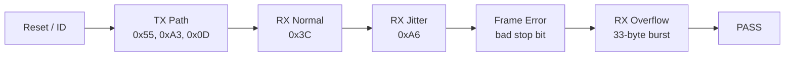
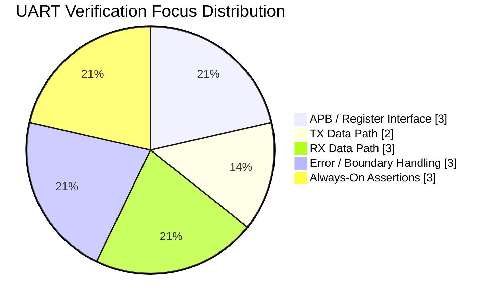
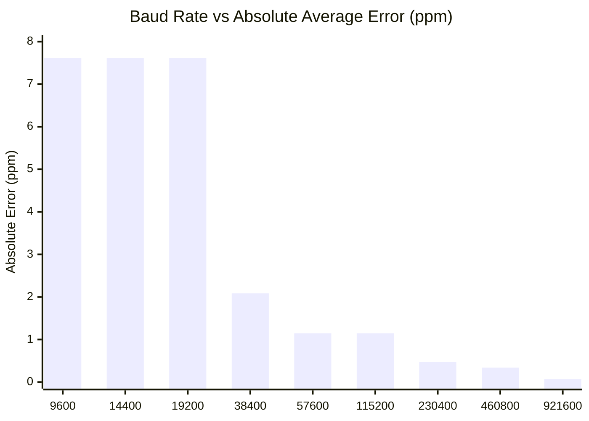
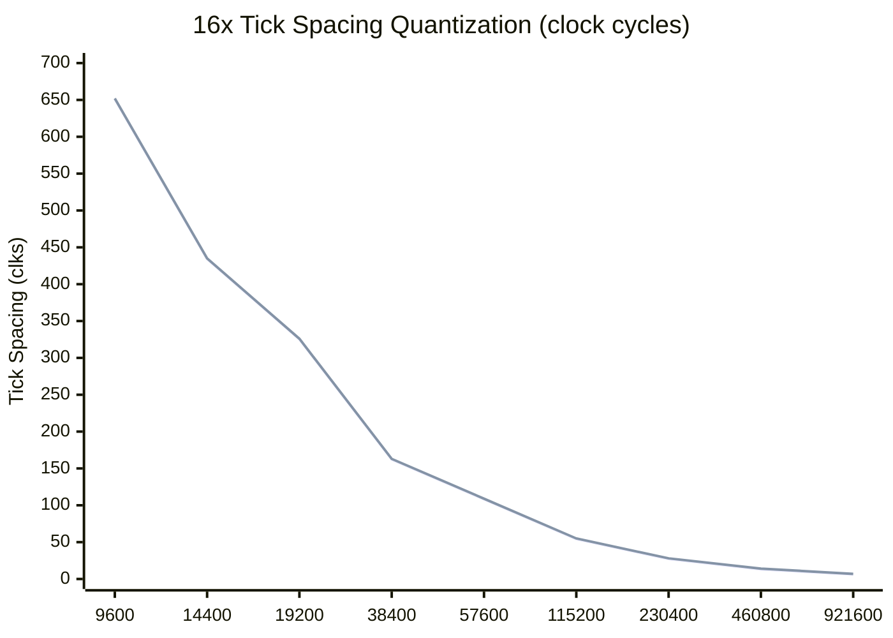
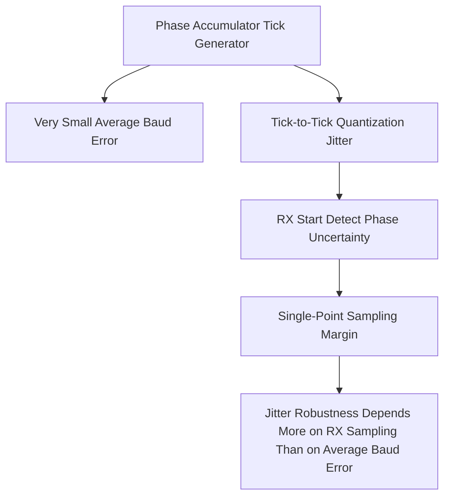
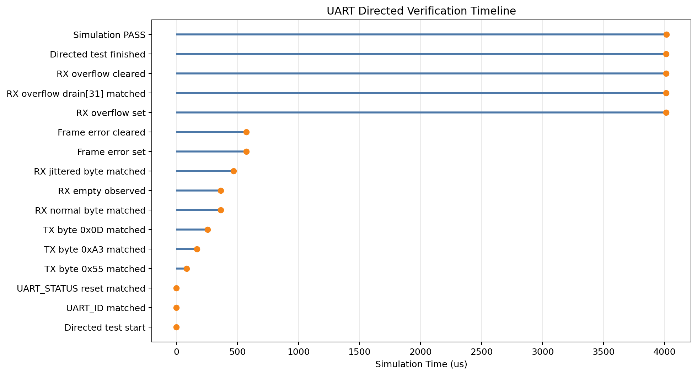
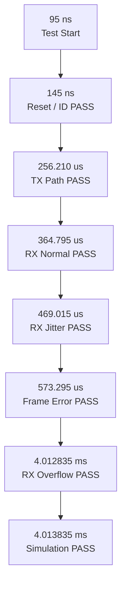
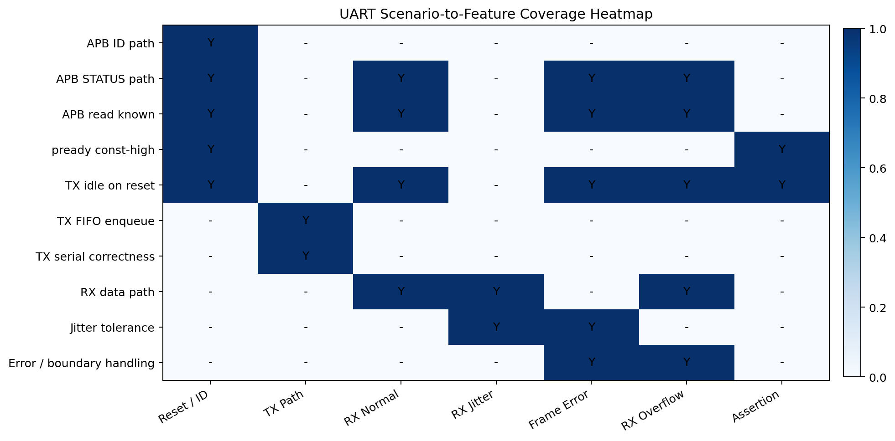

# UART Verification Visual Report

## 1. Snapshot

This dashboard-style note summarizes the UART directed verification status, the scenario-to-feature coverage map, the assertion status, and the baud-rate error visualization.

Related files:

- [uart_peripheral_report.md](./uart_peripheral_report.md)
- [uart_verification_run_log.md](./uart_verification_run_log.md)
- [uart_baud_error_table.csv](../data/uart_baud_error_table.csv)
- [uart_jitter_sweep_results.csv](../data/uart_jitter_sweep_results.csv)
- [uart_jitter_threshold_summary.csv](../data/uart_jitter_threshold_summary.csv)
- [uart_jitter_sweep_run_log.md](./uart_jitter_sweep_run_log.md)

## 2. Pass Summary

| Item | Result |
|---|---|
| Compile | PASS |
| Elaborate | PASS |
| Simulate | PASS |
| Directed scenarios | 6 / 6 PASS |
| TB assertions enabled | 3 |
| TB assertions failed | 0 |
| Final status | `tb_uart_apb_wrapper PASSED` |

## 3. Scenario Flow

## 4. Scenario Coverage Matrix

Legend:

- `Y`: directly covered by the scenario
- `A`: covered by always-on TB assertion
- `-`: not directly checked in that scenario

| Feature / Checkpoint | Reset / ID | TX Path | RX Normal | RX Jitter | Frame Error | RX Overflow | Assertion |
|---|---|---|---|---|---|---|---|
| APB ID read path | Y | - | - | - | - | - | - |
| APB STATUS read path | Y | - | Y | - | Y | Y | - |
| `pready` constant-high behavior | - | - | - | - | - | - | A |
| TX line idle during reset | Y | - | - | - | - | - | A |
| APB read response known/no X | Y | - | Y | - | Y | Y | A |
| TX FIFO enqueue | - | Y | - | - | - | - | - |
| TX serial data correctness | - | Y | - | - | - | - | - |
| RX normal data path | - | - | Y | - | - | - | - |
| RX jitter tolerance | - | - | - | Y | - | - | - |
| Frame error sticky set | - | - | - | - | Y | - | - |
| Frame error clear path | - | - | - | - | Y | - | - |
| RX overflow sticky set | - | - | - | - | - | Y | - |
| RX FIFO drain ordering | - | - | - | - | - | Y | - |
| RX overflow clear path | - | - | - | - | - | Y | - |

## 5. Coverage Summary by Domain

## 6. Directed Scenario Inventory

| Scenario | Stimulus | Expected Observation | Main RTL Area |
|---|---|---|---|
| Reset / ID | Read `UART_ID`, `UART_STATUS` after reset | Correct ID, TX/RX empty default state | `uart_apb_wrapper` |
| TX Path | APB writes `0x55`, `0xA3`, `0x0D` | Same bytes serialized on `o_uart_tx` | `uart_core`, `Top_FIFO`, `tx` |
| RX Normal | Inject clean serial `0x3C` | `RXDATA = 0x3C`, FIFO empties after pop | `rx`, `uart_core` |
| RX Jitter | Inject `0xA6` with alternating bit-period jitter | RX still decodes `0xA6` | `baud_tick_16`, `rx` |
| Frame Error | Inject `0xF0` with bad stop bit | `FRAME_ERROR` sets and clears | `rx`, `uart_core`, `uart_apb_wrapper` |
| RX Overflow | Fill 32-byte RX FIFO, then inject one extra byte | Overflow sets, first 32 bytes preserved, extra byte dropped | `Top_FIFO`, `uart_core` |

## 7. Assertion Set

Current TB assertions in [tb_uart_apb_wrapper.sv](../../tb/uart_peri_tb/tb_uart_apb_wrapper.sv):

| Assertion | Intent | Status |
|---|---|---|
| `p_pready_always_high` | Ensure the UART APB slave is zero-wait-state | PASS |
| `p_tx_idle_during_reset` | Ensure TX line stays idle high during reset | PASS |
| `p_apb_response_known` | Ensure APB read response is never X/Z during an active read | PASS |

Recommended next assertion set for future `bind`-based checking:

| Proposed assertion | Why it is useful |
|---|---|
| `frame_error` sticky until explicit clear | Encodes software-visible error retention |
| `rx_overflow` sticky until explicit clear | Encodes FIFO overflow persistence |
| `tx_busy` only during active TX FSM states | Checks status/FSM consistency |
| RX done only after valid stop check | Strengthens receiver correctness |
| TX start only when TX FIFO non-empty | Strengthens control-path legality |

## 8. Baud Error Visualization

Absolute baud error in ppm, computed from the phase-accumulator tick generator at `100 MHz` system clock:

Signed baud error:

| Baud | Signed Error (%) | Signed Error (ppm) |
|---|---:|---:|
| 9600 | `+0.000761449` | `+7.614` |
| 14400 | `+0.000761449` | `+7.614` |
| 19200 | `+0.000761449` | `+7.614` |
| 38400 | `-0.000208678` | `-2.087` |
| 57600 | `+0.000114698` | `+1.147` |
| 115200 | `+0.000114698` | `+1.147` |
| 230400 | `-0.000046990` | `-0.470` |
| 460800 | `+0.000033854` | `+0.339` |
| 921600 | `-0.000006568` | `-0.066` |

## 9. Tick Quantization Visualization

The baud generator is accurate on average, but each oversample tick spacing is quantized to either `N` or `N+1` clocks.

Interpretation:

- The average baud error is very small.
- The per-tick spacing is not perfectly uniform.
- The more meaningful robustness question is therefore RX sample placement and tolerance to disturbed bit timing.

## 10. Jitter Discussion Visual

## 11. Log Timeline Digest

## 12. Notebook-Generated Coverage Heatmap

## 13. Jitter Sweep Heatmap

The sweep covers `0% ~ 50%` alternating injected jitter with `1%` steps for every supported baud.

Threshold summary:

| Baud | Max PASS Jitter | First FAIL Jitter |
|---|---:|---:|
| 9600 | `43%` | `44%` |
| 14400 | `43%` | `44%` |
| 19200 | `43%` | `44%` |
| 38400 | `43%` | `44%` |
| 57600 | `44%` | `45%` |
| 115200 | `44%` | `45%` |
| 230400 | `44%` | `45%` |
| 460800 | `46%` | `47%` |
| 921600 | `48%` | `49%` |

## 14. Jitter Threshold Plots

Interpretation:

- Thresholds move slightly upward as baud increases in this alternating-jitter model.
- The percentage threshold increases with baud, but the absolute time-domain margin in ns still shrinks at high baud.

## 15. Recommended Slide Usage

Suggested use for presentation:

| Slide | Suggested content |
|---|---|
| 1 | UART architecture + scenario flow |
| 2 | Scenario coverage matrix |
| 3 | Assertion set + next assertion roadmap |
| 4 | Baud error chart + tick quantization chart |
| 5 | Jitter sweep heatmap + threshold plot |
| 6 | Timeline digest + overall PASS summary |
