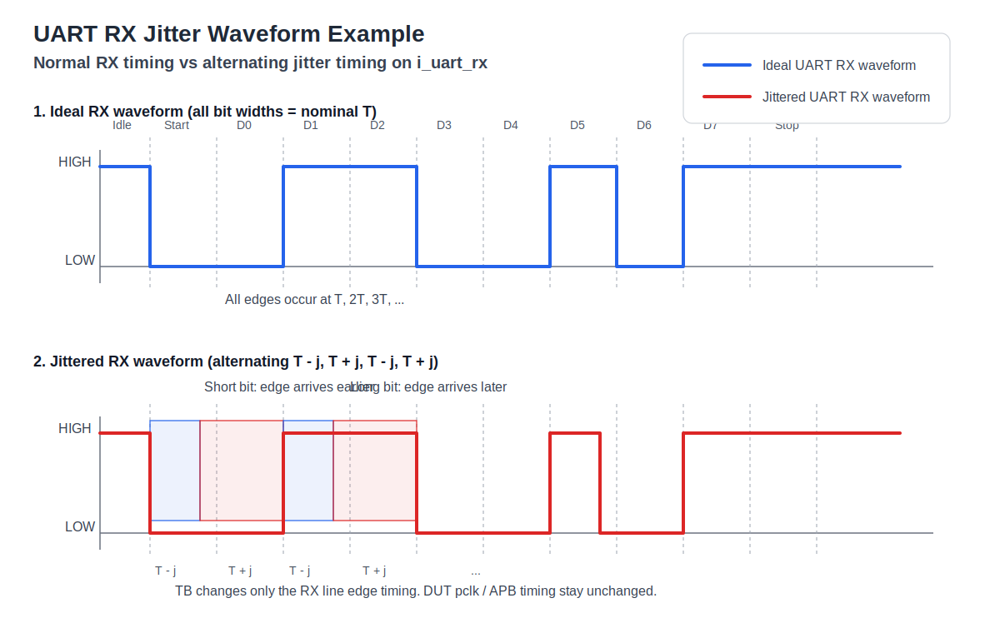

# UART RX Jitter 파형 설명

## 핵심 의미

- 위쪽 파형은 **정상 UART RX 입력**
- 아래쪽 파형은 **TB가 일부러 jitter를 넣은 UART RX 입력**

정상 파형에서는 각 bit가 모두 같은 길이 `T`를 가집니다.

반면 jitter 파형에서는 TB가 각 bit 유지 시간을 번갈아:

- `T - j`
- `T + j`
- `T - j`
- `T + j`

로 바꿉니다.

즉 TB는 DUT의 클럭을 흔든 것이 아니라,
`i_uart_rx`가 바뀌는 **edge 시점 자체를 앞당기거나 늦춘 것**입니다.

## 발표용 설명 문장

> 위 파형에서 점선은 nominal bit 경계이고, 아래 빨간 파형은 TB가 일부러 만든 jittered RX 입력이다.  
> 어떤 bit는 원래보다 짧게 유지해서 edge가 더 빨리 오고, 어떤 bit는 원래보다 길게 유지해서 edge가 더 늦게 온다.  
> DUT는 이런 timing disturbance가 있어도 원래 데이터를 복원해야 PASS한다.
