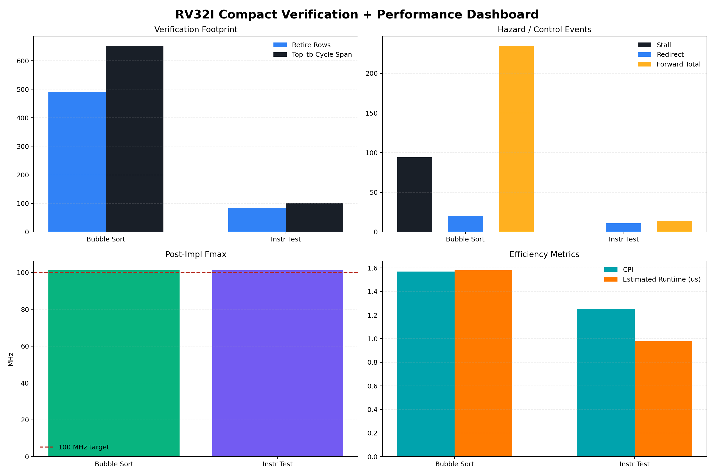

# RISC-V Pipeline Verification Project

RV32I 5-stage pipeline CPU를 Spike 기준 결과와 비교해 검증한 프로젝트입니다.  
대표 케이스별 retire compare, class-based testbench, 성능 지표를 함께 정리했습니다.



## 프로젝트 개요

- 구조: RV32I 5-stage pipeline CPU
- 기준 데이터: Spike 실행 결과 CSV
- 대표 케이스: `test_top`, `bubble_sort`
- 정리 기준: `src = RTL`, `tb = verification`, `reports = 설명 문서`, `evidence/output = 근거 자료`

## 먼저 볼 자료

- [START_HERE_ko.md](START_HERE_ko.md)
- [Compact 보고서](reports/markdown/overview/rv32i_exec_compact_report_ko.md)
- [시각화 보고서](reports/markdown/overview/rv32i_spike_visual_report_ko.md)
- [케이스 매트릭스 보고서](reports/markdown/overview/rv32i_case_matrix_report_ko.md)
- [성능 보고서](md/performance_metrics_report.md)
- [케이스 인덱스](spike_cases/index.md)
- [HTML compact 보고서](reports/html/rv32i_exec_compact_report_ko.html)

## 소스코드와 자료 위치

| 경로 | 역할 |
| --- | --- |
| [src](src) | pipeline RTL |
| [tb](tb) | retire compare TB, Top_tb, perf TB |
| [reports](reports) | Markdown / HTML 보고서 |
| [evidence](evidence) | CSV와 xsim 로그 |
| [output/perf_measure](output/perf_measure) | 구현 성능 산출물 |
| [spike_cases](spike_cases) | 케이스별 보관본 |

## 대표 결과

| Case | Pipeline TB | Top_tb | Retire Rows | Coverage | Stall | Redirect | Forward Total |
| --- | --- | --- | ---: | ---: | ---: | ---: | ---: |
| `test_top` | PASS | PASS | 84 | 76.82% | 0 | 11 | 14 |
| `bubble_sort` | PASS | PASS | 490 | 81.36% | 94 | 20 | 235 |

## 성능 기준 요약

| Variant | Fmax (MHz) | Slack (ns) | CPI | Runtime (us) |
| --- | ---: | ---: | ---: | ---: |
| `default` | 101.266 | 0.125 | 1.253165 | 0.978 |
| `bubble` | 101.245 | 0.123 | 1.568627 | 1.580 |
| `hazard` | 104.482 | 0.429 | 1.342857 | 0.450 |
| `test2` | 100.100 | 0.010 | 1.271739 | 1.169 |

## 폴더 구조

```text
RISC-V_pipeline/
├─ src/                         # pipeline RTL
├─ tb/                          # retire compare / Top_tb / perf TB
├─ reports/                     # 설명 문서와 HTML 결과
├─ evidence/                    # 로그와 CSV
├─ spike_cases/                 # 케이스별 결과 보관본
├─ output/perf_measure/         # timing / utilization 원본
├─ scripts/
├─ tools/
├─ README.md
└─ START_HERE_ko.md
```

## 메모

- 이 프로젝트는 단순 RTL 구현보다 "기준 모델과의 비교 검증"과 "성능 수치 해석"을 함께 보여주는 데 의미가 있습니다.
- 재실행 시에는 `src/InstrMemPathsPkg.sv`의 경로 상수를 현재 작업 위치 기준으로 확인해야 합니다.
