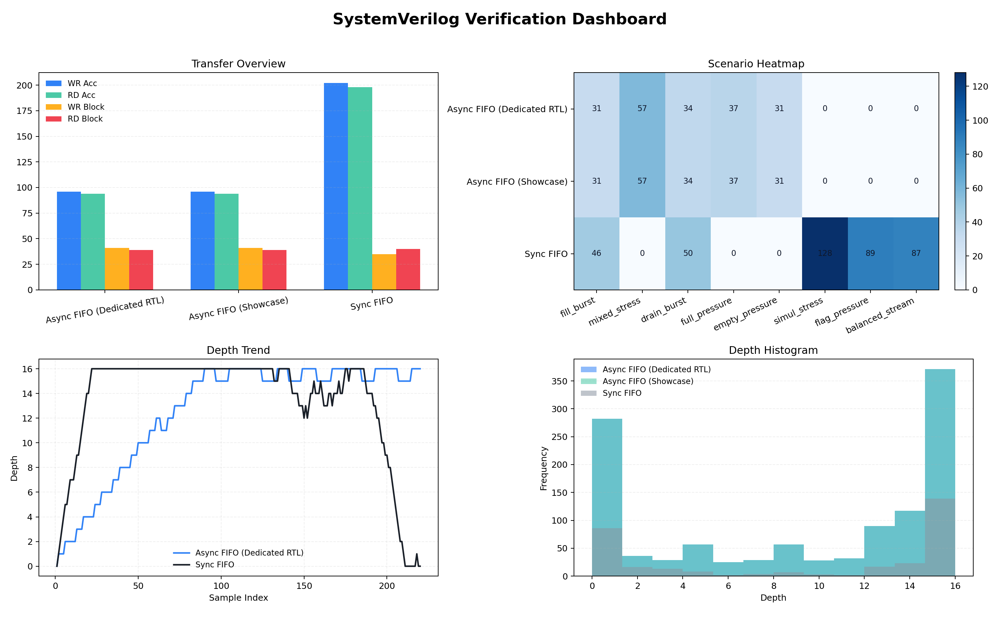

# SystemVerilog Verification Portfolio

비동기 FIFO, 동기 FIFO, UART RX, UART+FIFO 통합 경로를 대상으로 작성한 SystemVerilog 검증 문서입니다.
정식 IEEE UVM 라이브러리를 사용한 프로젝트는 아니지만, `transaction / generator / driver / monitor / scoreboard / environment` 역할 분리와 `interface + clocking block + self-checking` 구조를 참고해 testbench를 구성했습니다.



## 시작하기

- 메인 안내: [START_HERE_ko.md](START_HERE_ko.md)
- Markdown 보고서: [reports/markdown/overview/systemverilog_python_visual_report_ko.md](reports/markdown/overview/systemverilog_python_visual_report_ko.md)
- PDF 보고서: [reports/pdf/systemverilog_python_visual_report_ko.pdf](reports/pdf/systemverilog_python_visual_report_ko.pdf)
- HTML 보고서: [reports/html/index.html](reports/html/index.html)
- 검증 개요: [reports/markdown/overview/verification_overview.md](reports/markdown/overview/verification_overview.md)
- 전체 상세 보고서: [reports/markdown/overview/portfolio_report_ko.md](reports/markdown/overview/portfolio_report_ko.md)
- 모듈 보고서 인덱스: [reports/markdown/overview/module_reports_index_ko.md](reports/markdown/overview/module_reports_index_ko.md)

## 구성 내용

- GitHub에서 바로 볼 수 있는 Markdown 보고서
- Async FIFO와 Sync FIFO를 대상으로 한 self-checking testbench
- UART RX 단독 검증과 UART+FIFO 통합 검증
- `clocking block` 기반 drive / pre-sample / post-sample 타이밍 분리
- accepted / blocked path와 flag state를 함께 추적하는 scoreboard/coverage 구조
- TB가 직접 만든 CSV를 Python으로 시각화한 HTML/Markdown 보고서
- Vivado xsim 기준으로 재현 가능한 로그 증빙

## 검증 대상

### 1. Async FIFO

- RTL: [src/fifo.sv](src/fifo.sv)
- TB: [tb/fifo](tb/fifo)
- 포인트:
  - dual-clock async FIFO
  - accepted write/read와 blocked path 구분
  - `pre_cb`, `mon_cb`를 분리한 timing-aware monitor

### 2. Async FIFO RTL

- RTL: [src/async_fifo.sv](src/async_fifo.sv)
- TB: [tb/async_fifo](tb/async_fifo)
- 포인트:
  - active-high reset 기반 async FIFO
  - 별도 testbench 구조로 구성
  - scenario-aware scoreboard와 interface assertion

### 3. Sync FIFO

- RTL: [src/sync_fifo.sv](src/sync_fifo.sv)
- TB: [tb/sync_fifo](tb/sync_fifo)
- 포인트:
  - single-clock FIFO
  - same-cycle read/write 정책 반영
  - pre-count 기반 acceptance 판정

### 4. UART RX

- RTL: [src/uart_rx.v](src/uart_rx.v)
- TB: [tb/uart_rx](tb/uart_rx)
- 포인트:
  - 16x oversampling UART RX
  - valid frame + invalid stop frame 검증
  - serial task driver 기반 protocol stimulus

### 5. UART RX + FIFO

- RTL: [src/uart_rx_fifo_bridge.sv](src/uart_rx_fifo_bridge.sv)
- TB: [tb/uart_fifo](tb/uart_fifo)
- 포인트:
  - UART RX 결과를 `sync_fifo`로 버퍼링
  - fill/balanced/burst traffic 시나리오
  - ordering과 FIFO flag 상태 검증

### 6. UART TX + FIFO

- RTL: [src/uart_tx_fifo_bridge.sv](src/uart_tx_fifo_bridge.sv)
- TB: [tb/uart_tx_fifo](tb/uart_tx_fifo)
- 포인트:
  - buffered transmitter path 검증
  - FIFO dequeue와 UART launch 타이밍 정렬
  - launch boundary scoreboard + serial line assertion

### 7. UART + Async FIFO

- RTL: [src/uart_rx_async_fifo_bridge.sv](src/uart_rx_async_fifo_bridge.sv)
- TB: [tb/uart_async_fifo](tb/uart_async_fifo)
- 포인트:
  - UART RX 결과를 async FIFO로 넘기는 dual-clock 통합 경로
  - fill/balanced/drain async traffic 시나리오
  - ordering과 async FIFO flag 상태 검증

## 검증 결과

| Target | Status | Sample | PASS | FAIL |
| --- | --- | ---: | ---: | ---: |
| Async FIFO | PASS | 1153 | 190 | 0 |
| Async FIFO (Dedicated RTL) | PASS | 1153 | 190 | 0 |
| Sync FIFO | PASS | 320 | 838 | 0 |
| UART RX | PASS | 16 | 16 | 0 |
| UART RX + FIFO | PASS | 24 | 24 | 0 |
| UART TX + FIFO | PASS | 18 | 18 | 0 |
| UART + Async FIFO | PASS | 18 | 18 | 0 |

검증 로그:

- [evidence/logs/async_fifo_vivado.log](evidence/logs/async_fifo_vivado.log)
- [evidence/logs/async_fifo_src_vivado.log](evidence/logs/async_fifo_src_vivado.log)
- [evidence/logs/sync_fifo_vivado.log](evidence/logs/sync_fifo_vivado.log)
- [evidence/logs/uart_rx_vivado.log](evidence/logs/uart_rx_vivado.log)
- [evidence/logs/uart_fifo_vivado.log](evidence/logs/uart_fifo_vivado.log)
- [evidence/logs/uart_tx_fifo_vivado.log](evidence/logs/uart_tx_fifo_vivado.log)
- [evidence/logs/uart_async_fifo_vivado.log](evidence/logs/uart_async_fifo_vivado.log)

## 폴더 구조

```text
SV_Verification/
├─ src/                         # verification target RTL
├─ tb/                          # testbench
├─ reports/
│  ├─ html/                     # Toss-style HTML reports + chart images
│  ├─ pdf/                      # PDF export for GitHub viewing
│  └─ markdown/
│     ├─ overview/              # overview, portfolio, index docs
│     └─ module_reports/        # module-by-module detailed reports
├─ evidence/
│  ├─ logs/                     # Vivado xsim proof logs
│  └─ csv/                      # raw/combined CSV used by Python analysis
├─ tools/                       # Python analysis/plot scripts
├─ fpga_auto.yml
└─ requirements.txt
```

## 참고

- `reference`, `generated_docs` 같은 보조 자료는 제외했습니다.
- Python 대시보드는 FIFO 계열 CSV를 중심으로 구성되어 있습니다.
- UART 케이스는 모듈 보고서와 Vivado 로그에서 이어서 확인할 수 있습니다.
