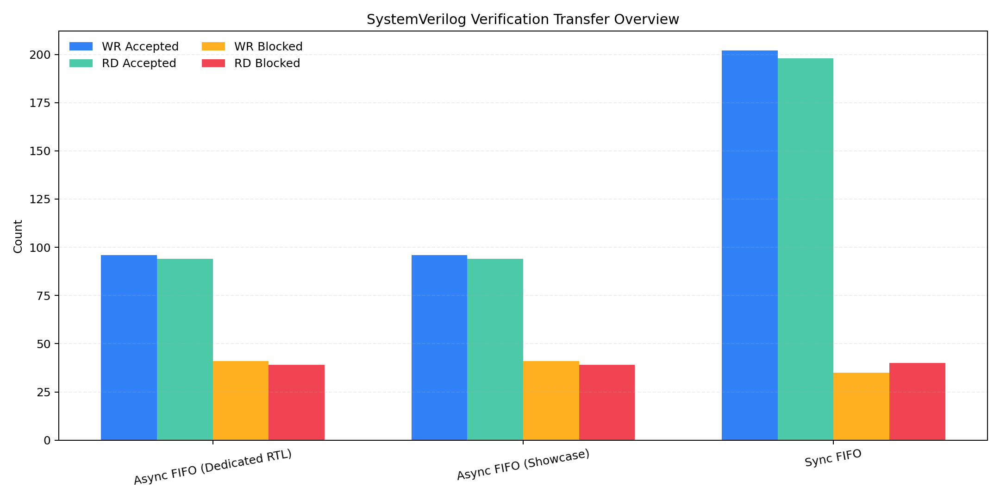
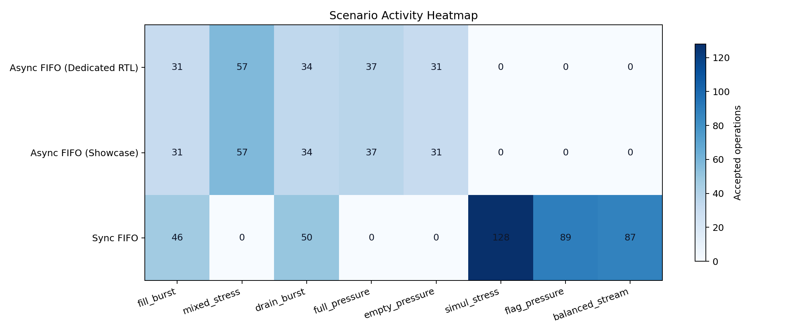
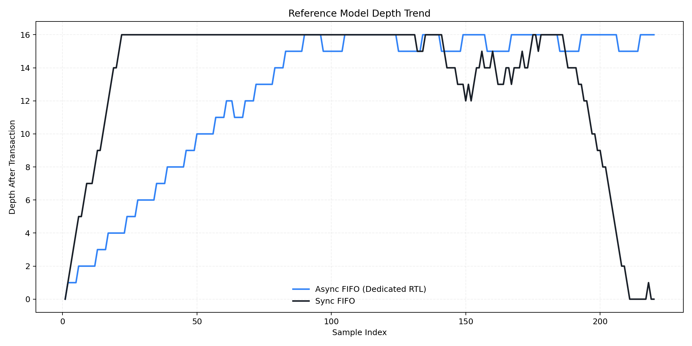
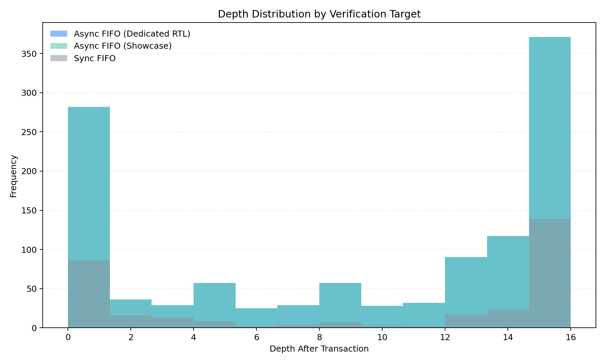

# SystemVerilog Python 시각화 보고서

TB scoreboard가 남긴 CSV를 Python으로 다시 정리한 문서입니다.  
GitHub에서 바로 볼 수 있도록 차트 이미지를 본문에 넣고, 각 그래프가 어떤 의미를 가지는지 짧게 정리했습니다.

## 바로 보기

- PDF: `reports/pdf/systemverilog_python_visual_report_ko.pdf`
- HTML: `reports/html/index.html`
- 검증 개요: `reports/markdown/overview/verification_overview.md`
- 전체 상세 보고서: `reports/markdown/overview/portfolio_report_ko.md`
- UART 상세 보고서:
  - `../module_reports/uart_rx_report_ko.md`
  - `../module_reports/uart_fifo_report_ko.md`
  - `../module_reports/uart_tx_fifo_report_ko.md`
  - `../module_reports/uart_async_fifo_report_ko.md`

## 요약

- FIFO 계열 검증 결과를 CSV, 차트, 표 기준으로 다시 정리했습니다.
- accepted path와 blocked path를 함께 기록해 boundary condition까지 같이 볼 수 있습니다.
- UART 계열은 별도 모듈 보고서와 Vivado 로그에서 이어서 확인할 수 있습니다.

## 전체 대시보드

- 모듈별 accepted/blocked count
- 시나리오별 activity 분포
- depth 변화 추세
- depth 분포

한 장에서 전체 흐름을 먼저 볼 때 사용하는 그림입니다.

## 모듈 비교

- x축: 모듈
- y축: 횟수
- WR/RD accepted와 WR/RD blocked를 같이 표시합니다.

Async FIFO 두 구현은 비슷한 패턴을 보이고, Sync FIFO는 same-cycle traffic 영향으로 accepted count가 더 크게 나타납니다.

## 시나리오 분포

- x축: 시나리오
- y축: 모듈
- 각 셀 숫자: `wr_acc + rd_acc`

어떤 시나리오에서 activity가 집중됐는지 확인할 수 있습니다.  
Async FIFO는 `mixed_stress` 비중이 높고, Sync FIFO는 `simul_stress`, `flag_pressure`, `balanced_stream` 쪽 activity가 크게 나타납니다.

## Depth 변화

- x축: sample index
- y축: transaction 이후 reference model depth

queue가 차고 비는 흐름이 시간 순서대로 보입니다.  
fill, mixed, drain 구간이 실제 depth 변화로 이어지는지 확인할 때 보는 그림입니다.

## Depth 분포

- x축: depth
- y축: frequency

특정 depth 구간에만 몰리지 않고 경계 상태까지 관측되었는지 볼 수 있습니다.

## 모듈 요약

| 모듈 | 결과 | 샘플 | PASS | FAIL | WR Acc | RD Acc | WR Block | RD Block | Coverage |
| --- | --- | ---: | ---: | ---: | ---: | ---: | ---: | ---: | ---: |
| Async FIFO (Dedicated RTL) | PASS | 1153 | 190 | 0 | 96 | 94 | 41 | 39 | 0.00% |
| Async FIFO (Showcase) | PASS | 1153 | 190 | 0 | 96 | 94 | 41 | 39 | 0.00% |
| Sync FIFO | PASS | 320 | 838 | 0 | 202 | 198 | 35 | 40 | 0.00% |

## 시나리오 요약

### Async FIFO 계열

- `fill_burst`: full 근처 동작과 write blocked path 확인
- `mixed_stress`: read/write 혼합 구간에서 ordering 확인
- `drain_burst`: empty 근처 동작과 read blocked path 확인
- `full_pressure`: backpressure와 full flag 일관성 확인
- `empty_pressure`: underflow protection과 empty flag 일관성 확인

### Sync FIFO

- `fill_burst`: queue를 채우는 구간 확인
- `simul_stress`: same-cycle read/write 정책 확인
- `drain_burst`: queue를 비우는 구간 확인
- `flag_pressure`: full/empty 근처 flag 경계 확인
- `balanced_stream`: steady-state traffic 확인

## Coverage 해석

- summary CSV는 `pass/fail` 외에 `wr_acc`, `rd_acc`, `wr_block`, `rd_block`를 함께 남깁니다.
- scenario CSV는 phase별 activity를 확인할 때 사용합니다.
- trace CSV는 sample 단위 depth 변화를 다시 그릴 때 사용합니다.

XSim 로그의 `coverage_pct`는 현재 0.00%로 남을 수 있습니다.  
그래서 이 문서에서는 covergroup bin 의도와 CSV 기반 결과를 함께 읽는 방식으로 정리했습니다.

## Assertion과 자동 판정

### Async FIFO (Dedicated RTL)

- `async_fifo_if.sv`: `oFull && oEmpty` 동시 high 금지
- `async_fifo_if.sv`: reset 이후 `oEmpty=1`, `oFull=0` 기대
- `async_fifo_driver.svh`: `vif`, `transaction` null 여부 immediate assertion
- `async_fifo_scoreboard.svh`: mismatch 시 `$fatal` 처리

### Async FIFO (Showcase)

- `fifo_if.sv`: `oFull && oEmpty` 동시 high 금지
- `fifo_if.sv`: reset 이후 `oEmpty=1`, `oFull=0` 기대
- `fifo_driver.svh`: `vif`, `transaction` null 여부 immediate assertion
- `fifo_scoreboard.svh`: mismatch 시 `$fatal` 처리

### Sync FIFO

- `sync_fifo_if.sv`: `oFull && oEmpty` 동시 high 금지
- `sync_fifo_if.sv`: reset 이후 `oEmpty=1`, `oFull=0` 기대
- `sync_fifo_scoreboard.svh`: data/flag mismatch 시 즉시 fail 처리

## 관련 경로

- Markdown: `reports/markdown/overview/systemverilog_python_visual_report_ko.md`
- HTML: `reports/html/index.html`
- PDF: `reports/pdf/systemverilog_python_visual_report_ko.pdf`
- 차트 폴더: `reports/html/assets`
- CSV: `evidence/csv`
- 로그: `evidence/logs`
